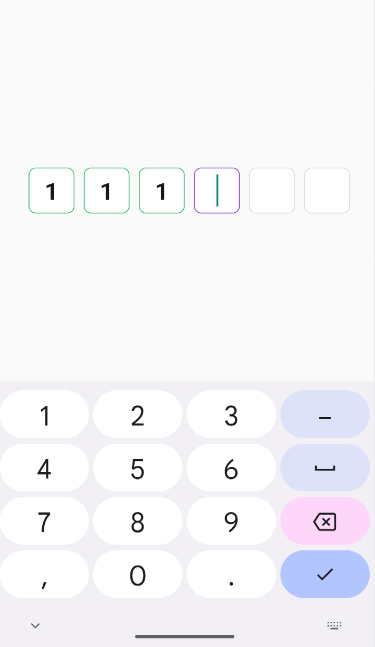

# react-native-otp-custom-library

Custome Otp Feild Use In React Native

## Installation

```sh
npm install react-native-otp-custom-library
```


## Usage

```js
import { OtpCustomLibraryView } from "react-native-otp-custom-library";

// ...

<OtpCustomLibraryView filledColor="red" />
```
| Props | Description |
| --- | --- |
| filledColor  | For Show Filled fields color  |
| nonFilledColor | For show not Filled fields color |
| currentFieldColor | For show current index border color |
| totalField |Total Fields |
| onChange | onChange = (val) =>{set your state = val} |
| style | styling for main Otp field container  |
| textInputStyle | styling for main Otp input field container |

## Contributing

See the [contributing guide](CONTRIBUTING.md) to learn how to contribute to the repository and the development workflow.

## License

MIT

---

Made with [create-react-native-library](https://github.com/callstack/react-native-builder-bob)
