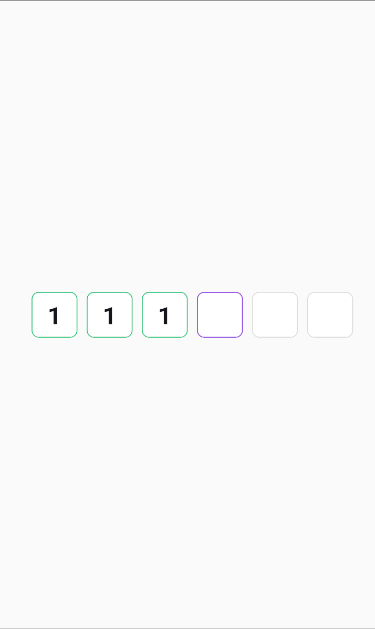

# react-native-otp-custom-library

Custom OTP Field for use in React Native.

## Installation

```sh
npm install react-native-otp-custom-library
```


## Usage

```js
import { OtpCustomLibraryView } from "react-native-otp-custom-library";

// ...

<OtpInput
filledColor="#21C274"
nonFilledColor="#DCDCDC"
currentFieldColor="#8735E1"
totalField={6}
onChange={onChange}
/>
```
| Props | Description | required |
| --- | --- | --- | 
| filledColor  | Border color for filled fields  | required |
| nonFilledColor |Border color for non filled fields | required |
| currentFieldColor | Border color for the current index border | required |
| totalField | Total number of fields | required |
| onChange | Callback for value change, e.g., onChange = (val) => { setYourState(val) } | required |
| style | Style for the main OTP field container  | 
| textInputStyle | Style for the OTP input fields |

## Contributing

See the [contributing guide](CONTRIBUTING.md) to learn how to contribute to the repository and the development workflow.

## License

MIT

---

Made with [create-react-native-library](https://github.com/callstack/react-native-builder-bob)
